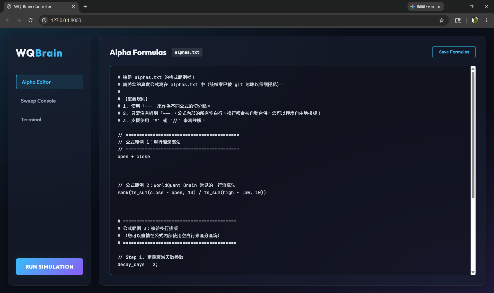
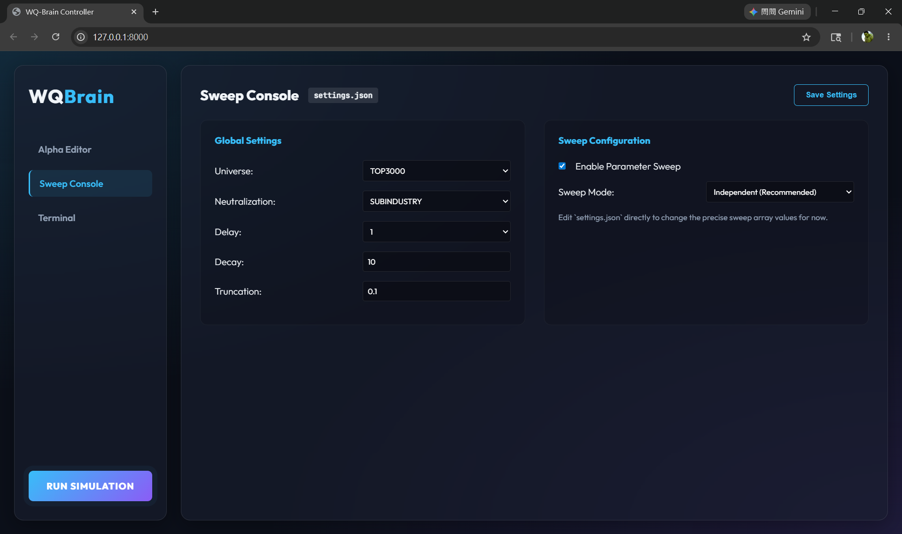

# WQ-Brain 自動化工具

這是一個用於 WorldQuant Brain 平台的自動化腳本集，支援自動模擬 (Simulate)、抓取 (Scrape) 以及提交 (Submit) Alphas 策略。

## 功能特性

- **圖形化網頁介面 (Web UI)**: 內建基於 FastAPI 打造的現代化深色主題網頁介面。提供 Alpha 公式編輯器、Sweep 參數掃描中控台，以及即時執行的終端機日誌，讓操作更加直覺。
- **自動化模擬 (`main.py`)**: 讀取 `parameters.py` 和 `commands.py` 中生成的參數設定，使用多執行緒自動向 WQBrain 提交模擬請求，並將結果存為 CSV 格式。支援自動登入與 Cookie 存續，避免頻繁的生物辨識驗證。
- **抓取達標策略 (`scrape_alphas.py`)**: 抓取帳號內符合特定條件 (如 Sharpe > 1.25, Fitness > 1, 未提交等) 的 Alpha 策略，輸出結果至 CSV，方便後續篩選。
- **自動提交策略 (`submit_alphas.py`)**: 讀取抓取出來的 CSV 檔案，自動將符合條件且相關性低於限制的策略提交至系統中。
- **策略庫 (`commands.py`, `database.py`)**: 內建多種生成 Alphas 語法的函式庫，包含常見的價量計算與 101 Alphas 等論文策略。

## 🎨 Web UI 網頁介面 (推薦)

為了提供最棒的使用體驗，我們打造了內建的 Web 介面。您可以透過網頁完成所有的公式編輯與參數設定。

1. **啟動伺服器**：
   在終端機輸入以下指令啟動 FastAPI 伺服器：
   ```bash
   python -m uvicorn server:app --host 127.0.0.1 --port 8000
   ```
2. **開啟瀏覽器**：
   前往 `http://127.0.0.1:8000` 即可進入儀表板。
3. **介面功能**：
   * **Alpha Editor**: 在網頁上直接撰寫、排版公式並儲存。
     
     
   
   * **Sweep Console**: 用下拉式選單與滑桿動態調整 Universe、Neutralization 等參數，系統會自動在背景存入 `settings.json` 並為其加上範圍限制 (例如 Decay 最大限制為 512，Truncation 最大限制為 1)。
     
     

   * **Terminal**: 點擊「RUN SIMULATION」後，可以在網頁上即時監控模擬日誌與登入狀態。
4. **停止伺服器**：
   在運行伺服器的終端機視窗中，按下 `Ctrl + C` 即可安全關閉伺服器。

## 檔案結構

- `main.py`: 主程式，負責 Alpha 的模擬與結果寫入。
- `scrape_alphas.py`: 抓取滿足條件且未提交的 Alphas 列表。
- `submit_alphas.py`: 讀取 CSV 將抓取出來的 Alphas 自動提交。
- `parameters.py`: 存放給 `main.py` 模擬用的 `DATA` 列表。
- `commands.py`: 存放大量用來生成 WorldQuant Brain Alpha 表達式的函式。
- `database.py`: 紀錄各類可用於生成的參數及欄位常數。
- `credentials.json`: 使用者的 WQBrain 登入帳密設定。
- `cookies.pkl`: 自動存放的登入 session cookies，用於跳過重複生物辨識。

## 安裝與設定

1. 安裝必要的 Python 套件：
   ```bash
   pip install requests pandas
   ```

2. 設定登入憑證：
   初次執行程式時，若找不到 `credentials.json`，終端機會提示您手動輸入 WorldQuant Brain 的 **Email** 與 **Password**，並自動替您儲存成 `credentials.json` 檔案。
   *(您也可以自行建立 `credentials.json` 檔案：)*
   ```json
   {
       "email": "your_email@example.com",
       "password": "your_password"
   }
   ```
   *注意：初次登入或 Cookie 失效時，程式碼將要求你手動透過瀏覽器完成生物辨識驗證，隨後 Cookie 將會被儲存至 `cookies.pkl`，以便後續自動登入。*

3. 建立公式檔 (`alphas.txt`)：
   因為策略配方屬於個人隱私，`alphas.txt` 已被預設忽略追蹤 (`.gitignore`)。**請您在使用前，先手動在專案資料夾內建立一個 `alphas.txt` 檔案**。
   * **公式格式**：支援多行書寫，並可使用 `#` 或 `//` 開頭來寫註解。
   * **公式區隔**：不同的 Alpha 公式之間，請務必使用 `---` 獨立一行作為分隔線。只要沒遇到 `---`，公式內部您可以自由加入任意數量的**空白行**與排版！
   * *(您可以直接參考專案內的 [alphas_example.txt](file:///d:/WQ-Brain/alphas_example.txt) 範例檔)*

## 💻 Terminal 終端機介面 (進階/無介面環境)

如果您在遠端伺服器或是不方便使用網頁介面的環境，您可以直接透過指令操作：

### 1. 執行 Alpha 模擬

1. 手動編輯目錄下的 `alphas.txt` 來寫入您的公式。
2. 開啟 `settings.json` 修改您的參數設定 (Universe、Delay，或是 Sweep 配置)。
3. 設定完成後，在終端機執行：

```bash
python main.py
```
這會自動讀取您設定的公式與參數，並啟動多個執行緒向 WQBrain 進行模擬，並將結果儲存至 `data/` 目錄下 (例如 `api_123456.csv`)。

### 2. 抓取達標的 Alphas

若要找出帳戶內已經模擬完成、達到提交標準且尚未提交的策略，執行：

```bash
python scrape_alphas.py
```
腳本會抓取相關紀錄，並輸出成 `data/alpha_scrape_result_<timestamp>.csv`。

### 3. 自動提交 Alphas

使用上述抓取到的 CSV 檔案，執行以下指令以自動送出符合條件的 Alpha：

```bash
python submit_alphas.py data/alpha_scrape_result_<timestamp>.csv
```

## 參數掃描運作機制

本工具在 `parameters.py` 中內建了強大的**多參數掃描 (Parameter Sweep)** 功能。當您希望測試同一組 Alpha 公式在不同參數設定下的表現時，無須手動反覆修改程式。

### 1. 如何啟用與設定
在 `parameters.py` 中：
* 將 **`ENABLE_SWEEP`** 設為 `True`。
* 在 **`SWEEP_PARAMS`** 中設定您想測試的所有參數範圍。
* 在 **`SWEEP_MODE`** 選擇您要使用的掃描模式：

### 2. 兩種掃描模式說明

#### 💡 A. 獨立單一變數掃描 (`SWEEP_MODE = 'independent'`) - 推薦使用
* **運作機制**：以 `SETTINGS` 為基準線，**每次只會變動一個參數**，其餘參數均保持預設值。
* **特色**：程式會自動過濾與預設基準重複的項目。此模式能精準找出各參數對 Alpha 表現的單獨影響，同時 **有效避免參數組合過多（組合爆炸）** 導致 API 請求被平台阻擋。
* **範例**：
  若基準 `SETTINGS` 為：`universe='TOP3000'`, `neutralization='SUBINDUSTRY'`, `decay=10`, `truncation=0.1`
  而您設定的 `SWEEP_PARAMS` 如下：
  ```python
  SWEEP_PARAMS = {
      'universe': ['TOP3000', 'TOP2000'],
      'neutralization': ['SUBINDUSTRY', 'SECTOR'],
      'decay': [5, 10, 15],
      'truncation': [0.01, 0.05, 0.1]
  }
  ```
  此模式會為每條 Alpha 自動生成 **7 組獨立模擬**：
  1. **基準（全預設）**：`TOP3000` + `SUBINDUSTRY` + `decay=10` + `truncation=0.1`
  2. **只改 Universe**：`TOP2000` + 其餘預設
  3. **只改 Neutralization**：`SECTOR` + 其餘預設
  4. **只改 Decay (5)**：`decay=5` + 其餘預設
  5. **只改 Decay (15)**：`decay=15` + 其餘預設
  6. **只改 Truncation (0.01)**：`truncation=0.01` + 其餘預設
  7. **只改 Truncation (0.05)**：`truncation=0.05` + 其餘預設

#### 🎛️ B. 笛卡爾積交叉掃描 (`SWEEP_MODE = 'grid'`)
* **運作機制**：將 `SWEEP_PARAMS` 中定義的所有參數範圍進行全排列（Cartesian Product），生成所有可能的交叉組合。
* **特色**：能地毯式搜索所有參數的協同效應，但模擬次數會呈指數級成長（例如上方範例在 Grid 模式下會產生 $2 \times 2 \times 3 \times 3 = 36$ 組模擬）。請謹慎使用以防觸發頻率限制。

## 自動提交運作機制

整個 Alpha 的篩選與提交過程是由 `scrape_alphas.py`（篩選過濾）與 `submit_alphas.py`（自動提交）協同完成的，其運作流程如下：

### 1. 篩選與過濾階段 (`scrape_alphas.py`)
* **搜尋符合門檻的未提交 Alpha**：
  腳本透過 API 篩選出您個人帳戶中符合以下條件且**尚未提交** (`status=UNSUBMITTED`) 的 Alpha 策略：
  * **Sharpe ≥ 1.25**（若 Delay = 0，則需 **> 2.0**）
  * **Turnover（換手率）1% ~ 70%**
  * **Fitness（適應度）≥ 1.0**（若 Delay = 0，則需 **> 1.3**）
* **多執行緒細部檢查**：
  使用 10 個執行緒（`ThreadPoolExecutor`）並行向 `/alphas/{id}/check` 取得詳細的檢驗報告，確保該 Alpha 在 In-Sample（IS）的所有系統檢查皆為 `PASS`。
* **公式清理與儲存**：
  去除代碼中的註解（以 `#` 開頭）與多餘的換行/空白，並將策略屬性（包含自我相關性 `max_corr`、`region`、`universe`、`neutralization` 等）存入 `data/alpha_scrape_result_<timestamp>.csv`。

### 2. 自動提交階段 (`submit_alphas.py`)
* **發送提交請求**：
  讀取篩選出的 CSV 檔案，並向 `https://api.worldquantbrain.com/alphas/{aid}/submit` 發送 `POST` 請求以啟動正式的提交審核。
* **輪詢（Polling）等待結果**：
  進入迴圈每隔 5 秒發送 `GET` 請求查詢進度。若遇到已提交過的策略會返回 `404` 並自動跳過。
* **自我相關性檢測（`SELF_CORRELATION`）**：
  系統會自動比對該策略是否與您（或團隊）已提交的策略有過高的相關性。若檢測結果為 `PASS`，則代表成功提交。
* **單次限額中斷**：
  為配合平台每日的提交限制，腳本在**成功提交第一個 Alpha 後**便會自動停止，確保安全與穩定。

## 注意事項

- **API 頻率限制**: 執行緒數量已進行調控 (例如 `main.py` 中 `max_workers=3`)，以避免觸發 WorldQuant Brain 的反爬蟲機制導致 Session 提早過期。
- **安全**: 請妥善保管 `credentials.json` 與 `cookies.pkl`，切勿上傳至公開的程式碼儲存庫中。專案中的 `.gitignore` 已經有忽略這些檔案以防外洩。
